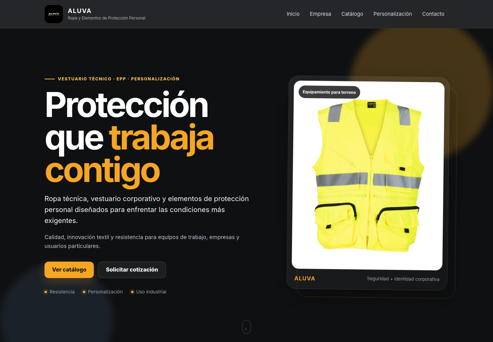
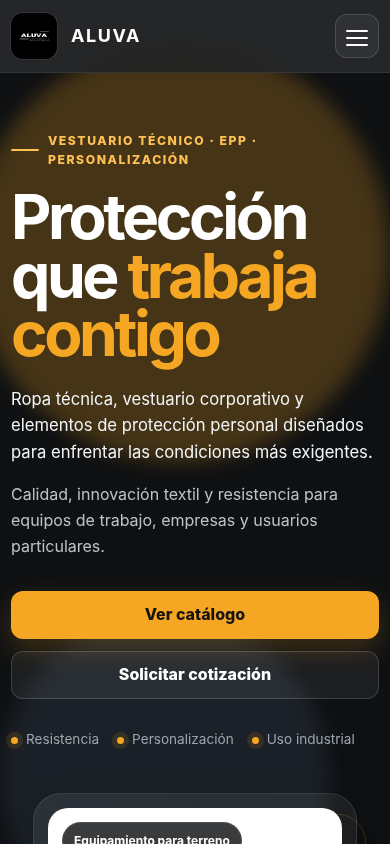

# ALUVA | Ropa y Elementos de Protección Personal

Sitio web responsive desarrollado para **ALUVA**, enfocado en la presentación de ropa técnica, vestuario corporativo, elementos de protección personal (EPP), catálogo de productos y servicios de personalización.

## Sitio publicado

**Netlify:** `REEMPLAZAR_AQUI_CON_LA_URL_DE_NETLIFY`

> Después de desplegar el proyecto en Netlify, reemplazar el texto anterior por la URL pública entregada por Netlify antes de la entrega final.

## Vista previa

### Escritorio



### Móvil



## Funcionalidades

- Navegación por secciones mediante menú principal.
- Menú adaptable para dispositivos móviles.
- Catálogo responsive de productos.
- Botones de cotización que preparan el correo con el producto seleccionado.
- Sección de personalización corporativa.
- Datos de contacto y enlaces a redes sociales.
- Animaciones de entrada y barra de progreso de desplazamiento.
- Diseño adaptable a escritorio, tablet y móvil.
- Consideraciones básicas de accesibilidad: textos alternativos, etiquetas ARIA, foco visible y soporte para `prefers-reduced-motion`.

## Tecnologías utilizadas

- HTML5
- CSS3
- JavaScript
- Git y GitHub
- Netlify para despliegue

## Estructura del proyecto

```text
ALUVA_Web_Final_Felipe_Barraza/
├── index.html
├── estilos.css
├── script.js
├── netlify.toml
├── README.md
├── imagenes/
└── screenshots/
```

## Ejecución local

No requiere instalación ni compilación. Se puede abrir `index.html` directamente en el navegador o ejecutar un servidor web local.

## Despliegue en Netlify

La carpeta raíz del proyecto contiene `index.html`, por lo que puede desplegarse directamente en Netlify sin proceso de build.

- **Build command:** ninguno.
- **Publish directory:** `.`

## Autor

**Felipe Barraza**  
Proyecto académico de Diseño Web, Unidad 3.
